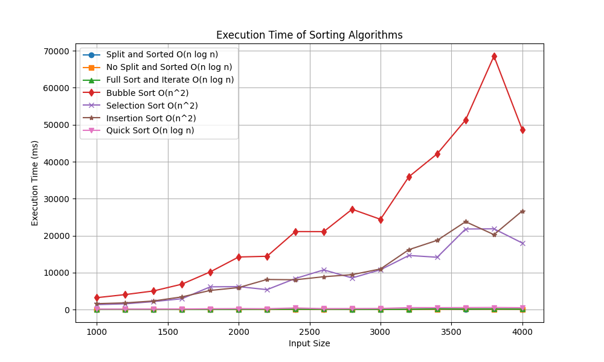
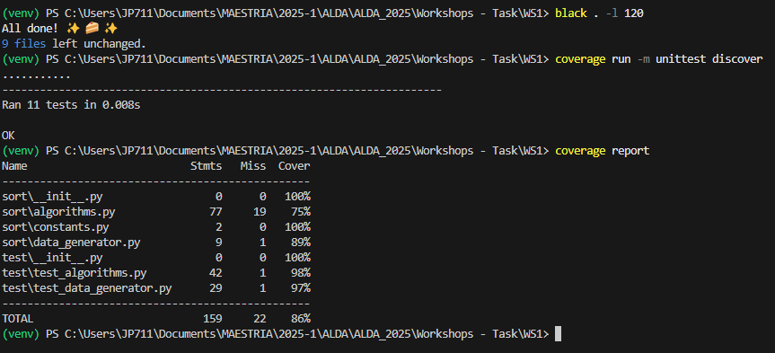

# ALDA 2025 - Sorting Algorithms

This repository contains the implementation and analysis of several sorting algorithms as part of Workshop 1 of the ALDA (Algorithm Analysis and Design) course.

## Project Structure
├── app.py # Main script to run the algorithms and graph the results
├── sort/ │
├── algorithms.py # Implementation of the sorting algorithms │
├── constants.py # Constants used in the project │
├── data_generator.py # Random data generator for testing │
├── execution_time_gathering.py # Gathering execution times
├── test/ │
├── test_algorithms.py # Unit tests for the algorithms
├── media/ # Generated images (comparisons, results, etc.)
├── requirements.txt # Project Dependencies
├── run.sh # Script to run the project
├── test.sh # Script to run the tests

## Implemented Algorithms

The following sorting algorithms are implemented in [`sort/algorithms.py`](sort/algorithms.py):

- **Split and Sorted Approach**: This algorithm splits the list into two parts, even and odd, sorts each part separately (even ascending, odd descending), and then combines them.
- **No Split and Sorted Approach**: Attempts to sort the entire list in a single pass, applying logic that sorts even ascending and odd descending simultaneously.
- **Full Sort and Iterate Approach**: First sorts the entire list conventionally, and then iterates through it to separate even and odd numbers in the desired order.
- **Bubble Sort**: Compares adjacent elements and swaps them if they are in the wrong order, repeating until the list is sorted.
- **Selection Sort**: Finds the smallest element and places it at the beginning, repeating the process for the rest of the list.
- **Insertion Sort**: Builds a sorted list by inserting each element into its correct position within the sorted portion.
- **Quick Sort**: Divides the list into smaller sublists using a "pivot," recursively sorting the sublists.

### Running the Project

To run the project and generate the runtime comparison graphs:

```bash
python [app.py]
```
This will run the main app.py script, which generates a runtime table and a comparison graph of the algorithms. The [`data_generator.py`](sort/data_generator.py) file is used to generate the test data that will be used by the sorting algorithms. Its purpose is to create lists of random numbers to evaluate the performance and correctness of the implemented algorithms.

## Results
The runtime results are automatically graphed and can be found in the media folder.
Example:

In this case, a minimum sample size of 1000 and a maximum sample size of 4000 are used, with jumps of 200 data points.



The graph shows the difference in efficiency between O(n log n) sorting algorithms (such as Merge Sort and Quick Sort) and O(n^2) sorting algorithms (such as Bubble Sort, Selection Sort, and Insertion Sort). It illustrates how runtime increases dramatically with input size for O(n^2) algorithms, making them impractical for large data sets. O(n log n) algorithms maintain a much slower and more manageable growth, highlighting the importance of choosing the right algorithm based on input size to optimize performance.

## Coverage
Coverage generates a report showing what percentage of each code file was covered during testing. The report also shows a summary of the total coverage for the entire project. In this case, 86% of the code was covered during testing.

